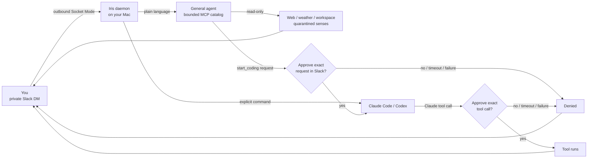

<p align="center">
  
</p>

<h1 align="center">Iris</h1>

<p align="center">
  <em>A local-first Slack assistant that can research autonomously and cross into action only through explicit authority.</em>
</p>

<p align="center">
  
  
  
  
</p>

<p align="center">
  <a href="#install">Install</a> ·
  <a href="#daily-use">Daily use</a> ·
  <a href="docs/ARCHITECTURE.md">Architecture</a> ·
  <a href="docs/OPERATIONS.md">Operations</a>
</p>

Iris is a private Slack DM to an assistant running on your Mac. It can hold a
normal conversation, perform bounded read-only research, remember explicitly
confirmed claims, inspect quarantined local context, and orchestrate coding
work. The general agent may decide that a coding task should be started from a
plain-English request, but the daemon validates the exact project/task and asks
for approval in the originating Slack thread before any process starts.

Iris stays connected while you are logged in and the Mac is awake. Slack Socket
Mode is outbound-only, so Iris hosts no public endpoint. Slack credentials live
in the macOS login Keychain; runtime state, memory, quarantine, approvals, and
audit records remain under `~/.iris/`.

The name is intentional: an iris controls how much light enters. Iris should be
powerful because it can reason across useful context while keeping authority
explicit and inspectable.

---

## How it fits together



Conversational prose cannot directly acquire shell, filesystem-write,
messaging, credential, or account authority. The only consequential tool
currently exposed to the general agent is `start_coding`, and it is mediated by
a daemon-owned local socket plus exact Slack approval.

## What it does

- **Converse and research.** A plain DM reaches the general-agent runtime with
  short-term thread context and trusted memory retrieval. Its fixed MCP catalog
  can perform bounded web, weather, workspace, and quarantined-sense reads.
- **Start coding from intent.** When a plain-English request is clearly asking
  Iris to carry out coding work, the agent can choose `claude` or `codex`, a
  project name, and a task. The daemon resolves the project beneath
  `projects_root`, posts the exact request to the originating Slack thread, and
  starts nothing unless you approve it.
- **Use explicit coding commands.** `claude <task>` and `codex <task>` remain
  available when you want deterministic control. Claude sessions stream output
  back to their Slack thread and accept follow-up prompts. Codex currently runs
  headless inside a forced `workspace-write` sandbox; its individual tool calls
  are not Slack-approved and its running session is not steerable through the
  Claude stream transport.
- **Remember carefully.** `remember <claim>` writes an operator-confirmed
  provenance record. Corrections supersede prior claims; forgetting hides a
  claim from retrieval while retaining an audit-preserving tombstone.
- **Read live Calendar context, opt-in.** EventKit access can be probed and an
  operator can refresh upcoming events into `~/.iris/senses.json`. Those events
  remain `untrusted` quarantine data and are never promoted to trusted memory by
  ingestion alone.
- **Fail closed.** General-agent coding actions, Claude tool calls, malformed
  approval requests, missing sockets, timeouts, and explicit denials all stop
  at the authority boundary. `stop` persists a disarmed marker across daemon
  restarts and only `irisctl rearm` from Terminal removes it.
- **Evaluate proactive help in shadow mode.** The salience/user-model/outcome
  scaffolding still exists but is not yet wired into the daemon and sends no
  unsolicited notifications.

## Current agentic scope

Iris is agentic for **reasoning, research, tool selection, and approval-bound
coding-session orchestration**. It is not yet a universal action agent. Email,
tasks, document mutation, calendar writes, general desktop control, and
proactive scheduling remain future capabilities and must receive their own
validated schemas, authority rules, deterministic tests, and live acceptance
gates before they can be described as working.

## Which models it uses

Iris holds no model API key. It shells out to the locally authenticated
`claude` and `codex` CLIs, so usage bills to those accounts.

| Path | Model |
| --- | --- |
| General Slack agent | Sonnet |
| Claude Code session | Opus |
| Codex session | whatever `~/.codex/config.toml` says |

Every Claude subprocess uses `--setting-sources ""` and
`--strict-mcp-config`, so operator settings files, hooks, and unrelated MCP
configuration cannot silently widen Iris's authority. Claude Code receives only
Iris's explicit PreToolUse approval hook.

## What it does not do

- It is not a cloud service, public Slack app, or multi-user admin tool.
- It does not expose an inbound HTTP listener or read Slack secrets from project
  files, prompts, DMs, or ordinary environment configuration.
- The general agent cannot directly write files, run arbitrary shell commands,
  send messages, modify accounts, or access credentials.
- Raw web, Calendar, or other external content never becomes trusted authority
  merely because it was retrieved.
- Calendar synchronization is operator-run rather than daemon-scheduled.
- Codex tool calls are sandbox-bounded rather than individually Slack-approved.
- Proactive notifications, email, tasks, document mutation, and broader desktop
  automation are not wired yet.

## Install

**Prerequisites:** macOS, Python 3.13+, a Slack workspace where you can create
an app, and locally installed/authenticated `claude` and `codex` CLIs.

```sh
git clone https://github.com/randyren278/iris.git
cd iris
python3.13 -m venv .venv
.venv/bin/python -m pip install --upgrade pip
.venv/bin/python -m pip install -e '.[dev]'
```

Set up the Slack app and place its two tokens in Keychain; the exact minimal
permissions and Keychain item names are in [Slack setup](docs/slack-setup.md).
Then create terminal-managed Iris configuration:

```toml
# ~/.iris/config.toml
slack_allowlist = ["YOUR_SLACK_USER_ID"]
projects_root = "/Users/you/Developer"
```

The allowlist contains stable Slack user IDs, never a display name or email.
Use the Slack client profile's **Copy member ID** command to obtain yours.

Verify credentials and the outbound Socket Mode connection before installing
the background service:

```sh
.venv/bin/python -m iris.slack_probe
./scripts/install.sh
.venv/bin/python -m iris.irisctl verify-online
```

`install.sh` writes one launchd agent at
`~/Library/LaunchAgents/com.iris.gateway.plist`, starts it, and configures a
minimal runtime `PATH` for the local CLIs. It does not copy credentials or
project state into the repository.

It also installs the optional read-only SwiftBar menu-bar indicator. See
[Operations](docs/OPERATIONS.md#menu-bar-indicator).

For Calendar, macOS asks for EventKit access the first time you run the probe:

```sh
# Verify read access only
.venv/bin/python -m iris.senses.calendar_probe

# Verify access and refresh the next 14 days into quarantined senses.json
.venv/bin/python -m iris.senses.calendar_probe --sync

# Optional different horizon
.venv/bin/python -m iris.senses.calendar_probe --sync --days 30
```

macOS currently labels the EventKit read permission as “full access”; Iris's
provider performs reads only and exposes no Calendar write operation.

## Daily use

Once the daemon is online, DM Iris normally. For example, “inspect the Iris
repo and fix the failing tests” may cause the general agent to research first,
then request an approval such as “start Claude in Iris: fix the failing tests.”
Nothing starts until you answer the approval.

Explicit commands remain available:

| Slack message | Result |
| --- | --- |
| `projects` | List projects beneath `projects_root`. |
| `cd <project>` | Select a default project; a `cd` inside an existing Slack thread overrides only that thread. |
| `claude <task>` | Start a Claude Code session in the selected project. |
| `codex <task>` | Start a sandboxed Codex exec session in the selected project. |
| `sessions` | List registered coding sessions. |
| `@<id> <prompt>` | Send another prompt to a live streamed Claude session. |
| `kill <id>` | Stop one session. |
| `stop` | Stop every session and persistently disarm the gateway. |
| `remember <claim>` | Store an explicitly confirmed self/team memory with Slack provenance. |
| `memories` | List retrievable trusted memory claims. |
| `correct <id> <claim>` | Add a replacement claim that supersedes a prior one. |
| `forget <id>` | Hide a claim from future retrieval while retaining its tombstone. |
| `y` / `n` | Approve or deny the oldest pending approval. |
| `y <id>` / `n <id>` | Resolve one exact pending approval when several are active. |

For weather, include a city: `what's the weather in Manila?` Iris returns
bounded current conditions and provider attribution rather than guessing your
location.

`stop` survives daemon restarts. Re-enable control only from Terminal:

```sh
.venv/bin/python -m iris.irisctl rearm
```

## How the boundary works

```text
Private Slack DM
      │ outbound Socket Mode
      ▼
Iris launchd daemon ──► allowlisted + DM-only router
      │                         │
      │ plain language          │ explicit command
      ▼                         ▼
Claude general agent        Claude Code / Codex
read-only MCP tools              │
      │                          ├─ Claude tool call → exact Slack approval
      └─ start_coding ──────────►│
             │                   └─ Codex → forced workspace-write sandbox
             ▼
      exact Slack approval
             │
             └─ daemon validates project + launches session
```

The model never receives a direct process handle from the general-agent path.
`start_coding` crosses a local Unix socket into the daemon, where project
selection, approval, emergency-stop state, launch policy, and Slack origin are
validated again.

## Operations and development

```sh
# Status / online check / restart / terminal-only re-arm
.venv/bin/python -m iris.irisctl status
.venv/bin/python -m iris.irisctl verify-online
.venv/bin/python -m iris.irisctl restart
.venv/bin/python -m iris.irisctl rearm

# Entire deterministic suite
.venv/bin/python -m pytest -q

# Structural production-wiring check
.venv/bin/python scripts/checks/wiring_audit.py

# Optional live provider / CLI probes
.venv/bin/python -m iris.weather_probe
.venv/bin/python -m iris.web_probe
.venv/bin/python -m iris.agent_probe
.venv/bin/python -m iris.hook_probe
.venv/bin/python -m iris.senses.calendar_probe

# Remove Iris's launchd agent and menu indicator
./scripts/uninstall.sh
```

The deterministic suite proves schemas, routing, denial behavior, thread
binding, action approvals, persistence, and fake-backed integrations. Live
probes remain necessary for Slack credentials, current Claude/Codex CLI
behavior, EventKit permissions, and real provider reachability. See
[Operations](docs/OPERATIONS.md) for the complete verification matrix.

## Repository map

```text
iris/                 gateway, agent/action policy, memory, senses, tools, runtime
scripts/              install/uninstall, menu bar, structural/live checks
tests/                unit, integration, acceptance, and contract coverage
docs/                 setup, architecture, operations, spike evidence
```

A feature is not “working” because a module exists. New capabilities should be
claimed live only when their production entry point is wired, deterministic
coverage exists, and any dependency that cannot be faked has a separate live
acceptance probe.
