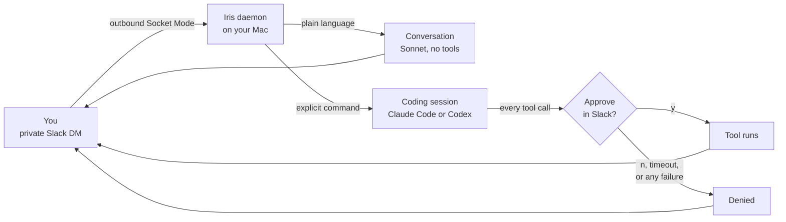

<p align="center">
  
</p>

<h1 align="center">Iris</h1>

<p align="center">
  <em>A local-first Slack interface for a capable assistant that keeps its hands off the controls until you say so.</em>
</p>

<p align="center">
  
  
  
  
</p>

<p align="center">
  <a href="#install">Install</a> ·
  <a href="#daily-use">Daily use</a> ·
  <a href="docs/ARCHITECTURE.md">Architecture</a> ·
  <a href="docs/OPERATIONS.md">Operations</a>
</p>

Most assistants are either a chat window or an autonomous process. Iris is
meant to be neither. It gives you a private Slack DM to a local assistant on
your Mac: natural conversation when you want to think, precise commands when
you want to work, and an explicit approval boundary whenever work would become
an action.

Iris stays connected while you are logged in and the Mac is awake. It uses
Slack Socket Mode, so the machine opens an outbound connection rather than
hosting a public endpoint. Your Slack credentials live in the macOS login
Keychain; state and audit records remain under `~/.iris/`.

The name is intentional: an iris controls how much light enters. Iris should
be useful because it pays attention, not because it silently takes control.

---

## How it fits together



Nothing crosses from prose to action without that gate. See
[Architecture](docs/ARCHITECTURE.md) for the trust boundary and model policy.

## What it does

- **Converse.** A plain DM is sent to a text-only Claude turn with short-term
  thread context. That turn has no tool access and cannot claim an action was
  performed.
- **Orchestrate coding work.** Select a project, start Claude Code or Codex,
  see progress in the originating Slack thread, and steer a running session.
- **Remember carefully.** Durable claims have a provenance record. Corrections
  supersede prior claims; forgetting hides a claim from retrieval while keeping
  an audit-preserving tombstone.
- **Read narrowly.** The first live sense is macOS Calendar, verified today by
  a read-only probe. The `SenseStore` quarantine/revoke pipeline that keeps
  source items untrusted and revocable is implemented but not yet wired into
  the daemon.
- **Evaluate proactive help.** A shadow-mode salience engine that scores
  explainable candidate reminders without sending them exists but is not yet
  wired into the daemon.
- **Require approval.** Claude Code tool calls are mediated by a local
  approval socket. A missing daemon, timeout, malformed request, or `n` is a
  denial. Codex sessions are bounded by a sandbox instead — see
  [Architecture](docs/ARCHITECTURE.md).

## Which models it uses

Iris holds no API key. It shells out to the `claude` and `codex` CLIs already
installed and logged in on your Mac, so usage bills to those accounts.

| Path | Model |
| --- | --- |
| Conversational DM | Sonnet |
| Claude Code session | Opus |
| Codex session | whatever `~/.codex/config.toml` says |

Every Claude subprocess runs with `--setting-sources ""`, so it loads none of
your settings files and runs none of your hooks. That keeps DM content out of
unrelated tooling and stops a settings file from weakening the approval path.

## What it does not do

- It is not a cloud service, a public Slack app, or a multi-user admin tool.
- It does not expose an HTTP listener or read Slack secrets from project files,
  environment variables, prompts, or DMs.
- It does not let plain conversational text trigger local actions.
- It does not promote raw calendar or other external content into trusted
  context automatically.
- It does not run proactive notifications outside the explicit, bounded
  salience path.

## Install

**Prerequisites:** macOS, Python 3.13+, a Slack workspace where you can create
an app, and locally installed `claude` and `codex` CLIs for coding orchestration.

```sh
git clone https://github.com/randyren278/iris.git
cd iris
python3.13 -m venv .venv
.venv/bin/python -m pip install --upgrade pip
.venv/bin/python -m pip install -e '.[dev]'
```

Set up the Slack app and place its two tokens in Keychain; the exact minimal
permissions and Keychain item names are in [Slack setup](docs/slack-setup.md).
Then create terminal-managed Iris configuration:

```toml
# ~/.iris/config.toml
slack_allowlist = ["YOUR_SLACK_USER_ID"]
projects_root = "/Users/you/Developer"
```

The allowlist contains stable Slack user IDs, never a display name or email.
Use the Slack client profile's **Copy member ID** command to obtain yours.

Verify credentials and the outbound Socket Mode connection before installing
the background service:

```sh
.venv/bin/python -m iris.slack_probe
./scripts/install.sh
.venv/bin/python -m iris.irisctl verify-online
```

`install.sh` writes one launchd agent at
`~/Library/LaunchAgents/com.iris.gateway.plist`, starts it, and configures a
minimal runtime `PATH` for the local CLIs. It does not copy credentials or
project state into the repository.

It also installs the menu bar indicator, a read-only
[SwiftBar](https://swiftbar.app) plugin that shows at a glance whether the
daemon is connected. It is optional: without SwiftBar the install prints a note
and continues. See [Operations](docs/OPERATIONS.md#menu-bar-indicator).

For Calendar’s optional local read-only smoke test, macOS will ask for Calendar
access the first time you run:

```sh
.venv/bin/python -m iris.senses.calendar_probe
```

The current EventKit API requires the macOS “full access” consent category to
read events. Iris’s probe only counts calendars; it does not write to Calendar.

## Daily use

Once the daemon is online, DM Iris in Slack. Plain language is a safe
conversation turn. Use commands for work that changes local state or starts a
coding session.

| Slack message | Result |
| --- | --- |
| `projects` | List projects beneath `projects_root`. |
| `cd <project>` | Select a project with safe fuzzy matching. |
| `claude <task>` | Start a Claude Code session in the selected project. |
| `codex <task>` | Start a Codex session in the selected project. |
| `sessions` | List active coding sessions. |
| `@<id> <prompt>` | Send another prompt to a running session. |
| `kill <id>` | Stop one session. |
| `stop` | Stop every session and disarm the gateway. |
| `memories` | List retrievable trusted memory claims. |
| `correct <id> <claim>` | Add a replacement claim that supersedes a prior one. |
| `forget <id>` | Hide a claim from future retrieval. |
| `y` / `n` | Approve or deny the oldest pending tool-call approval. |

`stop` is deliberately terminal-rearm only. This prevents a Slack message from
re-enabling control after an emergency stop.

## How the boundary works

```text
Private Slack DM
      │ outbound Socket Mode
      ▼
Iris launchd daemon ──► allowlisted + DM-only router
      │                         │
      │ plain language          │ explicit command
      ▼                         ▼
Text-only Claude turn      Claude Code / Codex session
no tools                   tool call → Slack y/n approval
      │                         │
      └────────── reply in original Slack thread ──────────┘
```

Iris never treats an unrecognized DM as a command. The conversational path is
separate from the orchestration path; the former returns prose, while the
latter is parsed into a restricted command grammar. See
[Architecture](docs/ARCHITECTURE.md) for the trust, memory, and runtime model.

## Operations and development

```sh
# Status / online check / restart
.venv/bin/python -m iris.irisctl status
.venv/bin/python -m iris.irisctl verify-online
.venv/bin/python -m iris.irisctl restart

# Entire deterministic test suite (no live Slack account required)
.venv/bin/python -m pytest -q

# Remove only Iris's launchd agent
./scripts/uninstall.sh
```

See [Operations](docs/OPERATIONS.md) for troubleshooting, state locations, and
the safe recovery path after sleep or network loss.

## Repository map

```text
iris/                 gateway, policy, memory, senses, and runtime modules
scripts/              launchd install / uninstall helpers, menu bar indicator
tests/                offline unit, integration, and acceptance coverage
docs/                 setup, architecture, and operational documentation
```

The project is intentionally local-first. Before connecting a new provider or
granting a new capability, write a deterministic fake-backed test and add a
separate live acceptance gate.
