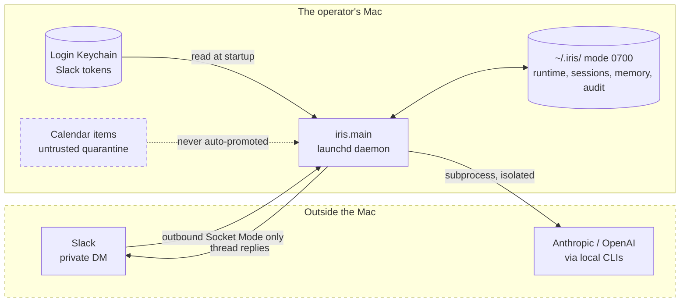
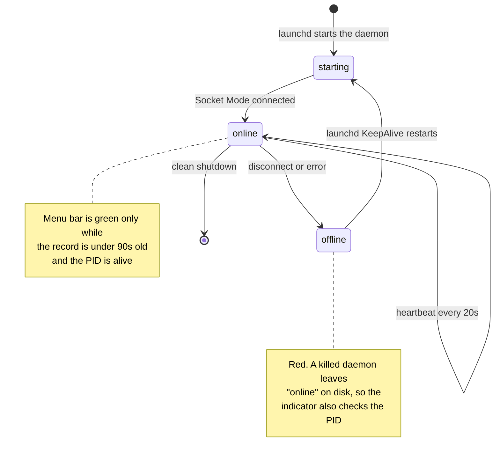
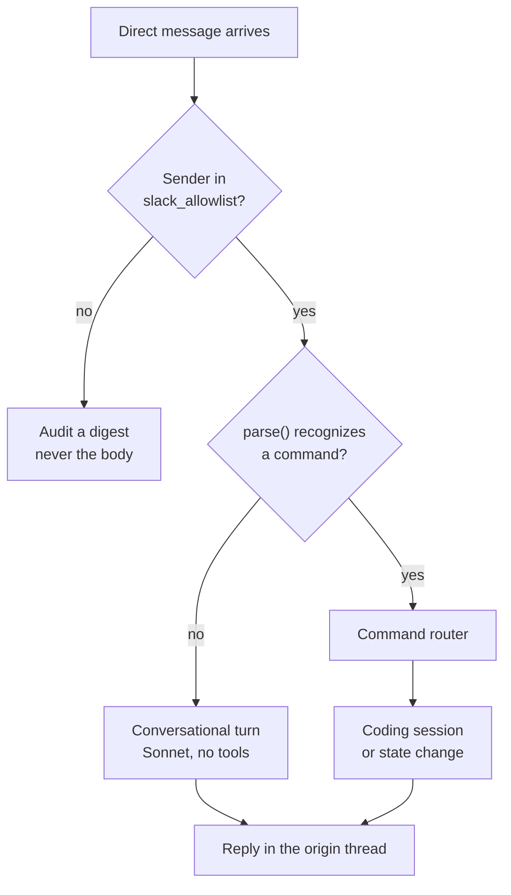
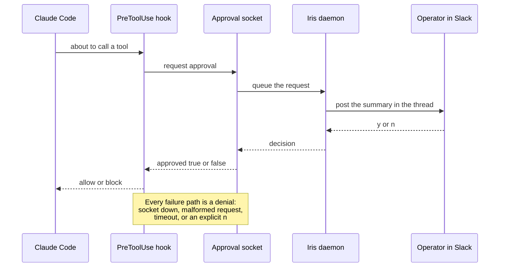

# Iris architecture

Iris is a local, single-operator Slack gateway. Its architecture optimizes for
three properties: clear authority boundaries, recovery after a laptop sleeps,
and evidence that the safety path still holds without a live Slack account.

## Trust boundary

Everything inside the dashed box is local. Nothing outside it can start an
action, and no external content becomes trusted context by arriving.

Iris binds no HTTP port, so there is no inbound path at all. Slack secrets come
only from the Keychain, and a rejected sender's text is recorded as a digest.

## Runtime

`launchd` starts `python -m iris.main` when the operator logs in. A runtime
supervisor owns a single instance lock and atomically updates
`~/.iris/runtime.json`. Its heartbeat reports `online` only after the Socket
Mode client connects; `irisctl verify-online` also rejects stale status.

The transport is Slack Socket Mode. The Mac opens the connection, receives
events, acknowledges the Socket Mode envelope, and posts thread replies through
Slack's Web API. Iris does not bind an HTTP port.

## Message routing

1. The Slack transport accepts only `message` events from a direct-message
   channel. Bot, subtype, duplicate, and malformed events are ignored.
2. The sender must be in `slack_allowlist`, a terminal-managed list of stable
   Slack user IDs. Rejected messages are audited by digest, never body text.
3. Recognized commands enter the deterministic command router. Unrecognized
   text is a conversational turn instead.
4. Every reply is posted to the original thread.

The conversation backend invokes Claude in text-only mode. Its system prompt
states that it has no tools and must not represent prose as a completed action.
The same prompt also governs Iris's conversational voice (tone-mirroring,
restrained humor), carrying the same safety carve-out around teasing in any
safety-sensitive reply. The command router is the only path that can start a
coding session.

## Models and isolation

Iris holds no API key. It shells out to the locally authenticated `claude` and
`codex` CLIs, so usage bills to whatever those CLIs are logged into.

| Path | Model | Why |
| --- | --- | --- |
| Conversational turn | `--model sonnet` | short, tool-less, and frequent |
| Claude coding session | `--model opus` | does the actual work |
| Codex session | unpinned | inherits `~/.codex/config.toml`, so the choice lives in one place |

Every Claude subprocess also passes `--setting-sources ""` and
`--strict-mcp-config`. This is a safety boundary, not tidiness. Without it a
nested `claude -p` loads the operator's own settings files and runs their hooks,
which means an unrelated hook can see raw DM content, inject unrelated context
into Iris's prompt, and add model calls the operator never asked for. It also
keeps an operator settings file from altering the tool-approval path that
`--settings` installs.

Those two flags suppress settings *files*; the explicit `--settings` JSON that
carries Iris's `PreToolUse` approval hook still applies. That is not an
assumption — `python -m iris.hook_probe` proves it against the real CLI by
forcing a tool call and asserting the hook fired.

## Coding sessions and approvals

Iris launches Claude Code or Codex only inside the selected project directory.
Claude Code sessions use manual permission mode. Before a tool call is allowed,
the approval hook contacts a Unix-domain socket owned by Iris. The daemon
renders the request in Slack and waits for `y` or `n`.

The flow fails closed: an unavailable socket, a malformed request, a timeout,
or a denial all return `approved: false`. `stop` terminates active sessions and
disarms the gateway; rearming is a terminal-only operation.

### The Codex residual

That approval path covers Claude Code only. Iris has no equivalent hook for
Codex, so a Codex session's tool calls are **not** individually approved in
Slack. The boundary there is the sandbox instead: Iris passes
`--sandbox workspace-write` on the command line, which overrides `sandbox_mode`
in the operator's `~/.codex/config.toml`, so a session may write inside its
project and nowhere else. Codex also runs through `codex exec`, the
non-interactive form; the bare interactive CLI exits with `stdin is not a
terminal` under launchd.

Closing this gap properly means carrying the approval socket into a Codex hook.
Codex has a hooks system, but its tool-call hook contract is not documented in
`codex exec --help`, so that work is a spike rather than a task. Until then,
treat a Codex session as sandbox-bounded rather than approval-gated.

## Data and trust

| Data | Location | Trust / lifecycle |
| --- | --- | --- |
| Slack app and bot tokens | macOS login Keychain | never loaded from repository files, prompts, or environment variables |
| Runtime state, sessions, audit, memory | `~/.iris/` | directory is created mode `0700`; atomic state files use mode `0600` where implemented |
| Approved memory claims | `~/.iris/memory.json` | only explicitly confirmed `self` or `team` claims are retrievable |
| Corrected / forgotten claims | same memory ledger | correction adds a superseding record; forgetting replaces the record with a tombstone |
| Calendar source metadata | operator-selected local store | `SenseStore` quarantines items as `untrusted` with source revocation, but this store is not yet wired into the daemon — only the read-only probe runs today |
| Audit records | `~/.iris/audit.jsonl` | append-only rotation; rejected inbound text is represented only by SHA-256 digest |

Trusted context injected into a conversation may only be `self` or `team`
memory. External source material is not promoted by retrieval, scoring, or
conversation alone.

## Present maturity

The architecture deliberately contains future-facing seams, but the README
only promises enabled behavior:

- Memory is a local provenance-aware JSON ledger with correction and forget
  semantics.
- The user-model and salience modules are currently bounded scaffolding. The
  salience engine defaults to shadow mode and sends no unsolicited messages.
- Calendar is the only live sense currently wired for a macOS read-only probe.
  Tasks, documents, and email remain planned integrations.
- Capability policy is deny-by-default. A new skill can be drafted but is not
  automatically made loadable.

The test suite and live acceptance checks are the source of truth for future
scope and human acceptance gates.
