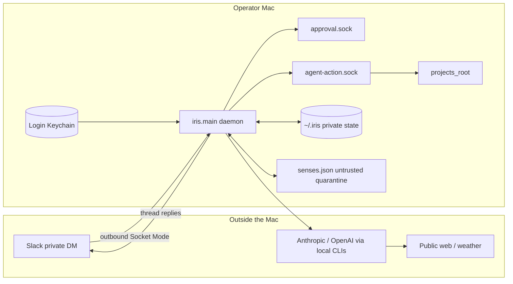
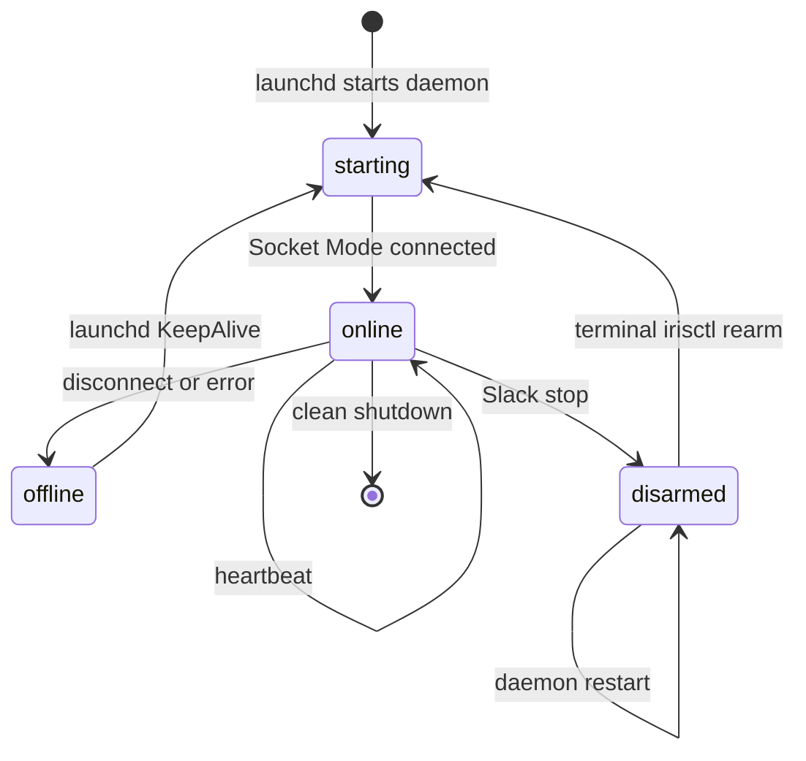
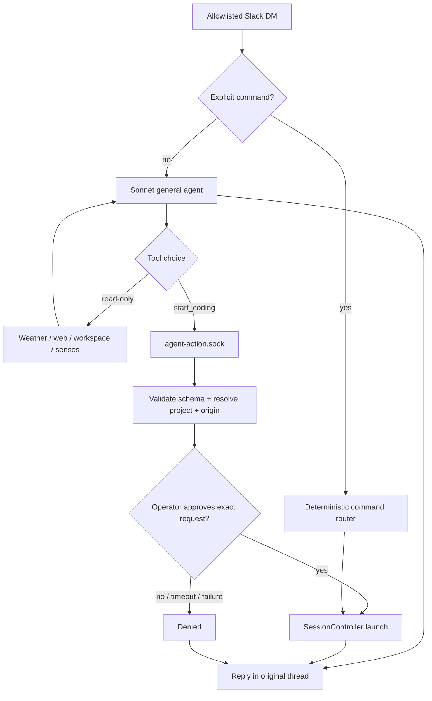
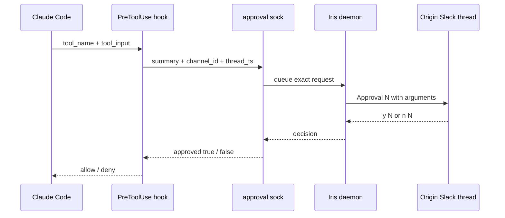

# Iris architecture

Iris is a local, single-operator Slack assistant. The architecture has two goals
that must coexist: give the model enough context and tool choice to be useful,
and keep consequential authority inside deterministic daemon-owned boundaries.
A model decision may *request* authority; it never manufactures authority.

## Trust boundary

Everything that can mutate local state is inside the operator's Mac. Slack is a
transport, models are reasoning engines, and retrieved content is data. None of
those become trusted merely by arriving.

Iris binds no inbound HTTP port. Slack tokens are read from the login Keychain.
Rejected senders are audited by digest rather than message body.

## Runtime and recovery

`launchd` starts `python -m iris.main`. `RuntimeSupervisor` owns a single-instance
lock and writes `~/.iris/runtime.json`; `irisctl verify-online` rejects stale or
o-longer-live status. Emergency stop state is separate: `stop` creates
`~/.iris/disarmed`, and a new daemon instance starts disarmed while that marker
exists. Only terminal command `irisctl rearm` removes it and restarts the job.

The persistent disarm marker matters because an in-memory boolean would silently
re-arm after a crash or restart.

## Message routing and agentic action

The Slack transport accepts only direct-message `message` events, rejects bots,
subtypes, duplicates and malformed envelopes, then applies the stable Slack-ID
allowlist. Recognized explicit commands enter the deterministic router.
Unrecognized text becomes a general-agent turn.

The general agent is shown a fixed catalog. Read-only tools include weather,
public web search/fetch, bounded workspace inspection, and quarantined senses
when a store exists. In production it is also shown one consequential tool:
`start_coding`.

Iris runs that catalog itself; the model never holds a tool handle. The nested
Claude process is launched with no built-in tools and no MCP server, and plans
in text: to use a tool it emits a `tool_request` JSON object, which
`AgentRuntime` validates through `iris/tool_protocol.py` and dispatches to the
Iris-owned handler in the daemon process. The handlers come from the same
`iris/mcp_server.py` `catalog()` the stdio MCP server publishes, so names,
schemas, and argument validation cannot drift. A request that fails validation
is treated as ordinary answer text and never dispatched.

Dispatch lives in Iris rather than in the CLI because the CLI only exposes
MCP tools when operator settings are loaded, and loading them would run the
operator's hooks over raw DM text. Iris-owned dispatch keeps
`--setting-sources ""` available while the tools still work.

`start_coding` does **not** launch a process inside the model. The handler
sends a structured request across `agent-action.sock` containing only
`tool`, `project`, `task`, and the exact Slack channel/thread supplied by the
daemon. `AgentActionServer` validates the schema again, resolves the project
through `ProjectCatalog`, asks for approval in that exact thread, checks the
persistent disarm state through `SessionController`, and only then launches.

This gives plain English real agency without giving conversational prose direct
shell or filesystem-write authority. Additional consequential domains must be
added as new daemon-owned structured actions rather than by widening the model's
raw tool permissions.

## Claude coding approvals

Claude Code sessions use Iris's `PreToolUse` hook. Before the subprocess starts,
`SessionController` passes the exact Slack channel/thread into the launch
environment. The hook renders the tool name plus bounded JSON arguments and
sends them through `approval.sock`. The server routes the notice using the
request's origin rather than whichever conversation happened most recently.

Approval IDs are globally ordered. Bare `y`/`n` resolves the oldest request;
`y <id>` / `n <id>` resolves one exact request, which is required when several
sessions or an agent action are waiting concurrently.

Every transport failure denies: absent socket, malformed payload, partial
origin, invalid response, notification failure, timeout, or explicit denial.

### Codex residual

Codex is intentionally different. Iris launches `codex exec` with
`--sandbox workspace-write` on the command line, overriding a wider sandbox
setting in the operator config. Codex tool calls are not individually routed
through Slack approval, and the current Claude stream transport does not make a
Codex exec session steerable from `@<id>`. The general agent may approval-start
a Codex session, but the authority boundary after launch is the forced sandbox.
Do not describe Codex as per-tool approval-gated until a current CLI-compatible
hook is implemented and live-tested.

## Models and subprocess isolation

| Path | Model | Authority |
| --- | --- | --- |
| General Slack agent | `sonnet` | fixed Iris-run catalog; reads plus approval-bound `start_coding` |
| Claude coding session | `opus` | project process; each tool call passes Iris PreToolUse approval |
| Codex exec session | operator config | forced `workspace-write` sandbox |

Every Claude subprocess passes `--setting-sources ""`, `--strict-mcp-config`,
and `--disable-slash-commands`. General-agent turns additionally pass
`--tools ""` and use no session persistence, so the process starts with an
empty tool list and no skills. This prevents operator settings, hooks, skills,
browser state, or unrelated MCP servers from silently becoming part of Iris's
authority surface. The invariant is checked live: with these flags the CLI
reports zero tools, zero slash commands, and runs no hooks.

## Memory and source trust

Trusted conversational context can only come from explicitly confirmed `self`
or `team` memory. `remember <claim>` creates a provenance record; correction
adds a replacement that supersedes an active record; forgetting leaves a
tombstone while removing the claim from retrieval.

External sources stay quarantined. Calendar synchronization reads upcoming
EventKit events into `~/.iris/senses.json` as `untrusted`. The general agent may
inspect those rows, but ingestion cannot convert them to trusted memory or
instructions.

| Data | Location | Boundary |
| --- | --- | --- |
| Slack tokens | login Keychain | startup read only |
| Runtime status | `~/.iris/runtime.json` | atomic health record |
| Emergency stop | `~/.iris/disarmed` | persistent until terminal re-arm |
| Sessions | `~/.iris/sessions.json` | daemon-owned registry |
| Memory | `~/.iris/memory.json` | operator-confirmed self/team claims only |
| Senses | `~/.iris/senses.json` | untrusted, revocable source data |
| Audit | `~/.iris/audit.jsonl` | append-only bounded log |
| Approval sockets | `~/.iris/*.sock` | mode `0600`, local process boundary |

## Calendar sense

`python -m iris.senses.calendar_probe` verifies EventKit read access. Adding
`--sync` reads a bounded upcoming horizon and refreshes the Calendar source in
the quarantine store. Synchronization is operator-run, not daemon-scheduled,
and the provider exposes no Calendar write method.

## Present maturity

The current live scope is deliberately narrower than the long-term assistant
vision:

- General reasoning, bounded research, trusted-memory retrieval, Calendar
  quarantine reads, and approval-bound coding-session starts are wired.
- Claude coding tool calls are approval-gated; Codex is sandbox-bounded.
- The salience engine is **not wired** and remains shadow-mode scaffolding.
- The user model is **not wired** into production conversation or planning.
- The outcome ledger is **not wired** to session completion or capability
  verification.
- Session lanes are **not wired** into production orchestration.
- Hera memory export is **not wired** into the daemon.
- The natural-language fallback translator is **not wired**; the production
  general agent uses MCP plus the action bridge instead.
- Email, tasks, document mutation, calendar writes, and general desktop control
  are planned integrations, not current capabilities.

## Evidence and claim policy

A green unit test is not enough evidence for a product claim. For each claimed
capability Iris should maintain four layers:

1. a production entry point that is actually reachable from `iris.main` or an
   explicitly documented operator CLI;
2. deterministic tests for schema, routing, denial, concurrency, and state;
3. an acceptance test spanning the real local components rather than only a
   similarly named fake;
4. a live probe for behavior that depends on Slack, EventKit, the installed
   Claude/Codex CLI, or an external provider.

The repository's wiring audit rejects unexplained dead modules. The master
agency acceptance gate now covers action-server execution, MCP exposure,
production adapter configuration, exact approval routing, persistent stop state,
and no-self-escalation. Live probes remain separate because fake Slack or a fake
CLI cannot prove installed dependency behavior.
